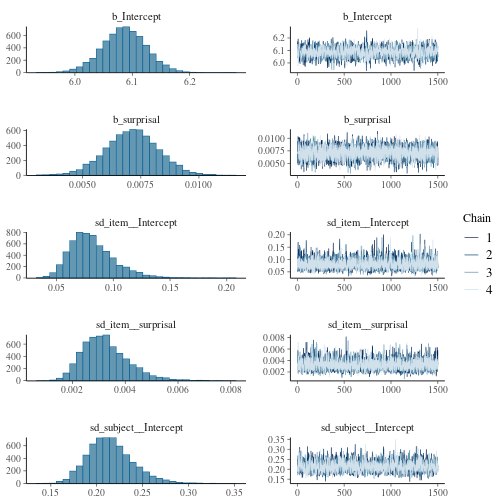
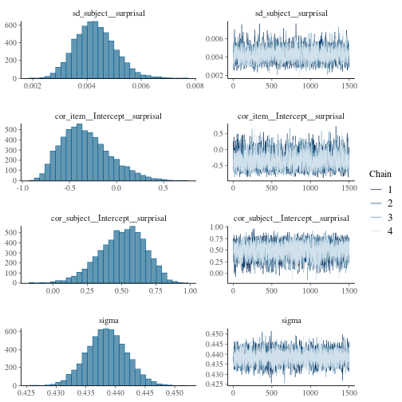
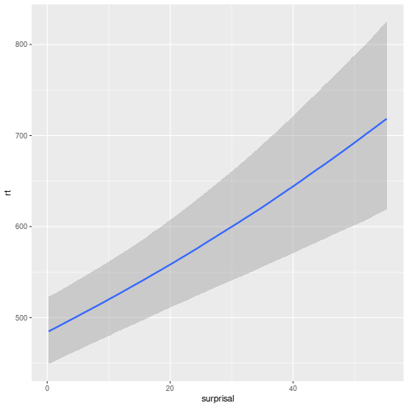

This vignette demonstrates how to use the `pangoling` package to estimate the 
effect of *surprisal* on reading times (RTs) in a psycholinguistic experiment. 

Surprisal is a measure of processing difficulty based on the unexpectedness of a
word in its context. In information theory, the surprisal [or Shannon's Information,
see @shannon1948mathematical] of x in bits is defined as $-\log_2 P(x)$. In the context of language, this translates to $-\log_2 P(\text{word}|\text{context})$,
where $P(\text{word}|\text{context})$ is the probability of the word given its preceding context. Higher surprisal values indicate greater processing 
difficulty and suggest a cognitive processing bottleneck, as readers allocate 
more resources to processing unexpected words [@levy2008; 
@hale2001probabilistic].
When surprisal is high, cognitive processing is supposed to slow down, which 
can be observed through longer reading times in reading tasks.


Surprisal is computed here using a GPT-2-like causal language model trained on
Chinese texts. We use `pangoling` to retrieve the surprisal values. The dataset 
comes from @JaegerEtAl2015, which features Chinese sentences presented 
word-by-word to participants during a self-paced reading experiment.


# Data analysis

## 0. Preprocessing

We load the required libraries first.


``` r
library(pangoling)
library(tidytable) # Lightweight and faster alternative to dplyr
library(tictoc)  # Report the time that a piece of code takes
library(brms) # Bayesian regression models in Stan
# Use all the cores needed available for brms:
options(mc.cores = parallel::detectCores()) 
```

The dataset `df_jaeger14` from @JaegerEtAl2015 contains Chinese sentences 
presented word-by-word to participants. Each word has an associated reaction 
time (RT). (The original research question and the experimental conditions 
don't matter to us.)


``` r
data("df_jaeger14")
df_jaeger14
#> # A tidytable: 8,624 × 14
#>    subject  item cond  word       wordn    rt region question   accuracy
#>    <chr>   <int> <chr> <chr>      <int> <int> <fct>  <chr>         <int>
#>  1 1m1         1 a     那個           1   360 Det+CL 那個顧客聽說過老闆…        1
#>  2 1m1         1 a     昨晚           2   359 Adv    那個顧客聽說過老闆…        1
#>  3 1m1         1 a     揍了服務生     3   344 VN     那個顧客聽說過老闆…        1
#>  4 1m1         1 a     一頓           4   313 FreqP  那個顧客聽說過老闆…        1
#>  5 1m1         1 a     的             5   297 DE     那個顧客聽說過老闆…        1
#>  6 1m1         1 a     顧客           6   312 head   那個顧客聽說過老闆…        1
#>  7 1m1         1 a     聽說過         7   297 hd1    那個顧客聽說過老闆…        1
#>  8 1m1         1 a     老闆           8   281 hd2    那個顧客聽說過老闆…        1
#>  9 1m1         1 a     並且           9   297 hd3    那個顧客聽說過老闆…        1
#> 10 1m1         1 a     記得          10   313 hd4    那個顧客聽說過老闆…        1
#> # ℹ 8,614 more rows
#> # ℹ 5 more variables: correct_answer <int>, question_type <int>,
#> #   experiment <chr>, list <int>, sentence <chr>
```

To avoid redundant computations, we extract unique combinations of items, 
conditions, and words. (We don't want to run our functions on the entire dataset
because there will be repetition across subjects, and thus the model will run 
several times on identical words in identical sentences):


``` r
df_stim <- df_jaeger14 |> distinct(item, cond, word, wordn)
df_stim |> print(n = 20)
#> # A tidytable: 704 × 4
#>     item cond  word       wordn
#>    <int> <chr> <chr>      <int>
#>  1     1 a     那個           1
#>  2     1 a     昨晚           2
#>  3     1 a     揍了服務生     3
#>  4     1 a     一頓           4
#>  5     1 a     的             5
#>  6     1 a     顧客           6
#>  7     1 a     聽說過         7
#>  8     1 a     老闆           8
#>  9     1 a     並且           9
#> 10     1 a     記得          10
#> 11     1 a     他。          11
#> 12     2 b     那輛           1
#> 13     2 b     下午           2
#> 14     2 b     摩托車追了     3
#> 15     2 b     很久           4
#> 16     2 b     的             5
#> 17     2 b     轎車           6
#> 18     2 b     發現了         7
#> 19     2 b     記者           8
#> 20     2 b     所以           9
#> # ℹ 684 more rows
```


We use the `pangoling` function `causal_preload()` to load the GPT-2 model
[`uer/gpt2-chinese-cluecorpussmall`](https://huggingface.co/uer/gpt2-chinese-cluecorpussmall).
This model is trained on Chinese texts and can predict word probabilities
based on preceding context.


``` r
causal_preload("uer/gpt2-chinese-cluecorpussmall")
#> Preloading causal model uer/gpt2-chinese-cluecorpussmall...
```

## 1. Add surprisal values to the dataset

Surprisal in bits (i.e., we use a logarithm with base 2) is calculated as
$-\log_2(P(\text{word}|\text{context}))$, which is equivalent to
$\log_{1/2}(P(\text{word}|\text{context}))$. The `pangoling` function
`causal_words_pred()` is configured to:

- Use `log.p = 0.5` to get surprisal in bits.
- Set `sep = ""` since Chinese words are not separated by spaces.
- Process sentences in batches of 10 for efficiency.


``` r
tic()
df_stim <- df_stim |>
  mutate(surprisal = causal_words_pred(
    word,
    by = interaction(item, cond),
    log.p = 0.5,
    model = "uer/gpt2-chinese-cluecorpussmall",
    sep = "",
    batch_size = 10
  ))
#> Processing using causal model 'uer/gpt2-chinese-cluecorpussmall/' ...
#> Processing a batch of size 10 with 33 tokens.
#> Processing a batch of size 10 with 33 tokens.
#> Processing a batch of size 10 with 33 tokens.
#> Processing a batch of size 10 with 33 tokens.
#> Processing a batch of size 10 with 33 tokens.
#> Processing a batch of size 10 with 33 tokens.
#> Processing a batch of size 4 with 33 tokens.
#> Text id: 1.a
#> `那個昨晚揍了服務生一頓的顧客聽說過老闆並且記得他。`
#> Text id: 2.a
#> `那輛下午追了摩托車很久的轎車發現了記者所以停了下來。`
#> Text id: 3.a
#> `那個今天打了男孩幾次的女孩看到了校長所以假裝讀書。`
#> Text id: 4.a
#> `那輛當時撞了自行車兩次的吉普車攔住了警察並且要求調查清楚。`
#> Text id: 5.a
#> `那個剛才推了男孩一下的婦人偷了店員并且打傷了她。`
#> Text id: 6.a
#> `那個上個月邀請了男孩幾次的女孩認識王老師因為上過她的課。`
#> Text id: 7.a
#> `那條去年救了主人好幾次的狗喜歡小男孩所以很興奮。`
#> Text id: 8.a
#> `那個剛才推了職業選手一下的業餘選手罵了裁判而且威脅了他。`
#> Text id: 9.a
#> `這個上個月監視了殺手一段時間的偵探討厭當地人所以沒有尋求幫助。`
#> Text id: 10.a
#> `那位最近抱怨了房東好多次的住戶找了律師而且打算起訴。`
#> Text id: 11.a
#> `那個上個月罵了教練一頓的球員愛上了女歌星還送她禮物。`
#> Text id: 12.a
#> `那位以前崇拜了指揮家很久的作曲家結識了小提琴手並且兩人常見面。`
#> Text id: 13.a
#> `這個去年批評了電影局幾次的女演員很欣賞金城武因為他個性坦率。`
#> Text id: 14.a
#> `那位上個月約了飛行員兩次的空姐惹怒了經理因為她常遲到。`
#> Text id: 15.a
#> `這位今天稱讚了導演多次的男明星批評了影評家並且表示很難過。`
#> Text id: 16.a
#> `那位昨天採訪了作家兩個小時的記者質疑了縣長候選人而且揚言報復。`
#> Text id: 1.b
#> `那個昨晚服務生揍了一頓的顧客聽說過老闆並且記得他。`
#> Text id: 2.b
#> `那輛下午摩托車追了很久的轎車發現了記者所以停了下來。`
#> Text id: 3.b
#> `那個今天男孩打了幾次的女孩看到了校長所以假裝讀書。`
#> Text id: 4.b
#> `那輛當時自行車撞了兩次的吉普車攔住了警察並且要求調查清楚。`
#> Text id: 5.b
#> `那個剛才男孩推了一下的婦人偷了店員并且打傷了她。`
#> Text id: 6.b
#> `那個上個月男孩邀請了幾次的女孩認識王老師因為上過她的課。`
#> Text id: 7.b
#> `那條去年主人救了好幾次的狗喜歡小男孩所以很興奮。`
#> Text id: 8.b
#> `那個剛才職業選手推了一下的業餘選手罵了裁判而且威脅了他。`
#> Text id: 9.b
#> `這個上個月殺手監視了一段時間的偵探討厭當地人所以沒有尋求幫助。`
#> Text id: 10.b
#> `那位最近房東抱怨了好多次的住戶找了律師而且打算起訴。`
#> Text id: 11.b
#> `那個上個月教練罵了一頓的球員愛上了女歌星還送她禮物。`
#> Text id: 12.b
#> `那位以前指揮家崇拜了很久的作曲家結識了小提琴手並且兩人常見面。`
#> Text id: 13.b
#> `這個去年電影局批評了幾次的女演員很欣賞金城武因為他個性坦率。`
#> Text id: 14.b
#> `那位上個月飛行員約了兩次的空姐惹怒了經理因為她常遲到。`
#> Text id: 15.b
#> `這位今天導演稱讚了多次的男明星批評了影評家並且表示很難過。`
#> Text id: 16.b
#> `那位昨天作家採訪了兩個小時的記者質疑了縣長候選人而且揚言報復。`
#> Text id: 1.c
#> `老闆聽說過那個昨晚揍了服務生一頓的顧客並且通知了記者。`
#> Text id: 2.c
#> `記者發現了那輛下午追了摩托車很久的轎車所以停了下來。`
#> Text id: 3.c
#> `校長看到了那個今天打了男孩幾次的女孩所以上前詢問。`
#> Text id: 4.c
#> `警察攔住了那輛當時撞了自行車兩次的吉普車並且要求調查清楚。`
#> Text id: 5.c
#> `店員偷了那個剛才推了男孩一下的婦人并且打傷了她。`
#> Text id: 6.c
#> `王老師認識那個上個月邀請了男孩幾次的女孩因為教過她的課。`
#> Text id: 7.c
#> `小男孩喜歡那條去年救了主人好幾次的狗所以很興奮。`
#> Text id: 8.c
#> `裁判罵了那個剛才推了職業選手一下的業餘選手而且警告了他。`
#> Text id: 9.c
#> `當地人討厭這個上個月監視了殺手一段時間的偵探所以沒有提供幫助。`
#> Text id: 10.c
#> `律師找了那位最近抱怨了房東好多次的住戶而且打算起訴。`
#> Text id: 11.c
#> `女歌星愛上了那個上個月罵了教練一頓的球員還送他禮物。`
#> Text id: 12.c
#> `小提琴手結識了那位以前崇拜了指揮家很久的作曲家並且兩人常見面。`
#> Text id: 13.c
#> `金城武很欣賞這個去年批評了電影局幾次的女演員因為她個性坦率。`
#> Text id: 14.c
#> `經理惹怒了那位上個月約了飛行員兩次的空姐因為他常冷嘲熱諷。`
#> Text id: 15.c
#> `影評家批評了這位今天稱讚了導演多次的男明星並且表示很難過。`
#> Text id: 16.c
#> `縣長候選人質疑了那位昨天採訪了作家兩個小時的記者而且揚言報復。`
#> Text id: 1.d
#> `老闆聽說過那個昨晚服務生揍了一頓的顧客並且通知了記者。`
#> Text id: 2.d
#> `記者發現了那輛下午摩托車追了很久的轎車所以停了下來。`
#> Text id: 3.d
#> `校長看到了那個今天男孩打了幾次的女孩所以上前詢問。`
#> Text id: 4.d
#> `警察攔住了那輛當時自行車撞了兩次的吉普車並且要求調查清楚。`
#> Text id: 5.d
#> `店員偷了那個剛才男孩推了一下的婦人并且打傷了她。`
#> Text id: 6.d
#> `王老師認識那個上個月男孩邀請了幾次的女孩因為教過她的課。`
#> Text id: 7.d
#> `小男孩喜歡那條去年主人救了好幾次的狗所以很興奮。`
#> Text id: 8.d
#> `裁判罵了那個剛才職業選手推了一下的業餘選手而且警告了他。`
#> Text id: 9.d
#> `當地人討厭這個上個月殺手監視了一段時間的偵探所以沒有提供幫助。`
#> Text id: 10.d
#> `律師找了那位最近房東抱怨了好多次的住戶而且打算起訴。`
#> Text id: 11.d
#> `女歌星愛上了那個上個月教練罵了一頓的球員還送他禮物。`
#> Text id: 12.d
#> `小提琴手結識了那位以前指揮家崇拜了很久的作曲家並且兩人常見面。`
#> Text id: 13.d
#> `金城武很欣賞這個去年電影局批評了幾次的女演員因為她個性坦率。`
#> Text id: 14.d
#> `經理惹怒了那位上個月飛行員約了兩次的空姐因為他常冷嘲熱諷。`
#> Text id: 15.d
#> `影評家批評了這位今天導演稱讚了多次的男明星並且表示很難過。`
#> Text id: 16.d
#> `縣長候選人質疑了那位昨天作家採訪了兩個小時的記者而且揚言報復。`
#> ***
toc()
#> 108.104 sec elapsed
```

Inspect the calculated surprisal values:


``` r
df_stim |> print(n = 20)
#> # A tidytable: 704 × 5
#>     item cond  word       wordn surprisal
#>    <int> <chr> <chr>      <int>     <dbl>
#>  1     1 a     那個           1     21.8 
#>  2     1 a     昨晚           2     19.8 
#>  3     1 a     揍了服務生     3     36.5 
#>  4     1 a     一頓           4      4.94
#>  5     1 a     的             5      2.38
#>  6     1 a     顧客           6     11.0 
#>  7     1 a     聽說過         7     17.6 
#>  8     1 a     老闆           8      8.84
#>  9     1 a     並且           9     12.8 
#> 10     1 a     記得          10      8.51
#> 11     1 a     他。          11     16.5 
#> 12     2 b     那輛           1     34.4 
#> 13     2 b     下午           2     15.2 
#> 14     2 b     摩托車追了     3     34.3 
#> 15     2 b     很久           4      5.64
#> 16     2 b     的             5      5.21
#> 17     2 b     轎車           6     15.4 
#> 18     2 b     發現了         7     13.8 
#> 19     2 b     記者           8     13.4 
#> 20     2 b     所以           9      9.72
#> # ℹ 684 more rows
```

The surprisal values are merged back into the original dataset:


``` r
df_jaeger14 <- df_jaeger14 |> left_join(df_stim)
```

## 2. Analyze the dataset with a Bayesian hierarchical model

We estimate the effect of surprisal on reading times (RTs) using a Bayesian
hierarchical model. The model incorporates a hierarchical structure with 
by-subject and by-item group-level effects (also referred to as random effects),
which account for variability across subjects and items. The only 
population-level effect (also called a fixed effect) of interest in this 
analysis is surprisal.
(For simplicity, we do not scale or center the predictor.)

For a detailed discussion of Bayesian hierarchical structures (including prior
selection), see Section 4.2 and Chapter 5 of @nicenboim2025introduction, 
[*An Introduction to Bayesian Data Analysis for Cognitive Science*](https://bruno.nicenboim.me/bayescogsci/).


``` r
fit_surp <-
  brm(rt ~ surprisal + (surprisal| subject) + (surprisal| item),
      data = df_jaeger14,
      family = lognormal(),
      prior = c(prior(normal(6, 1.5), class = Intercept),
                prior(normal(0, 1), class = sigma),
                prior(normal(0, 1), class = sd),
                prior(normal(0, .1), class = b),
                prior(lkj(2), class = cor)),
      iter = 3000)
```

We visualize the posterior distributions and model diagnostics:


``` r
plot(fit_surp)
```




The effect of surprisal (in bits) on log-RT is summarized below:


``` r
posterior_summary(fit_surp, variable = "b_surprisal")
#>                Estimate   Est.Error        Q2.5       Q97.5
#> b_surprisal 0.007122151 0.001147024 0.004838423 0.009333683
```

The conditional effects of surprisal on the original millisecond scale can be 
plotted as well: 


``` r
conditional_effects(fit_surp)
```



# Conclusion

This vignette demonstrates how to calculate surprisal values using the 
`pangoling` package and estimate their effect on reading times using Bayesian
hierarchical modeling. By leveraging pre-trained transformer models, researchers
can explore the cognitive effects of surprisal in language comprehension 
experiments.

@levy2008 theory highlights how surprisal acts as a cognitive bottleneck: higher
surprisal reflects greater unexpectedness, which slows down processing due to 
the reallocation of cognitive resources. This example illustrates how models 
like GPT-2 can operationalize surprisal and facilitate testing such theories in
empirical data.


# References

